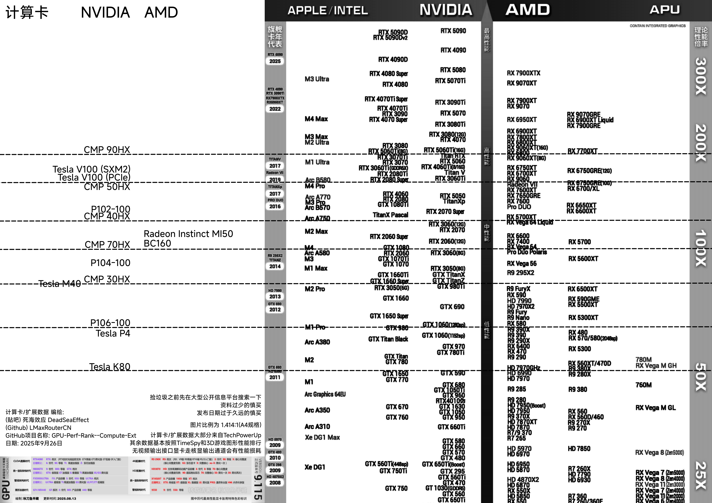

---

**原帖:*****[《史上最全桌面级显卡天梯图》专用更新帖(公测版)](https://tieba.baidu.com/p/6133450546)***
**我的贴吧主页:*****[死海效应-DeadSeaEffect](https://tieba.baidu.com/home/main?id=tb.1.c471fc29.C5t0iu3e4GcSQQSDanvP6g?t=1758821577&fr=pb)***

扩展数据大部分来自TechPowerUp
其余数据基本按照TimeSpy和3D游戏图形性能排行

图片比例为 1.414:1(A4规格)(为了打印)
绘图软件是PhotoScape X Pro
这个方式有点太不适合forkpr了, 之后应该会换个方式

**提示:**
- **专业计算卡普遍在计算及AI方面比同高度的零售家用卡强很多**
- 捡垃圾之前先在大型公开信息平台搜索一下, 资料过少的慎买, 发布日期过于久远的慎买

## Q&A

点击展开/折叠

- 为什么是黑白的?
  - 我打印机是黑白的所以为黑白打印机专门做了优化

